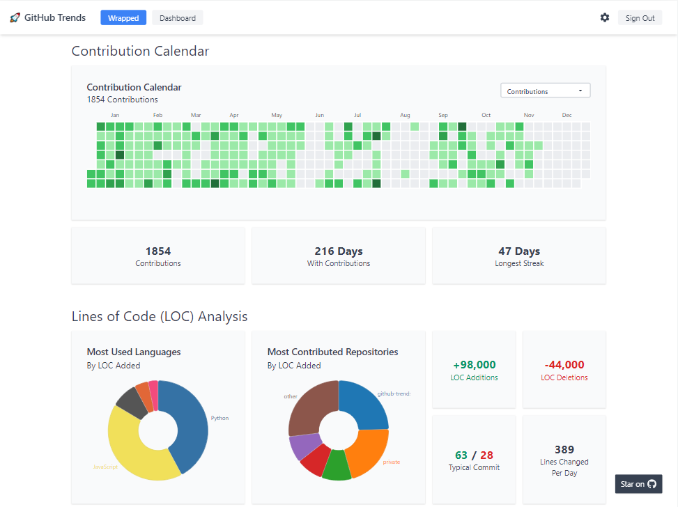
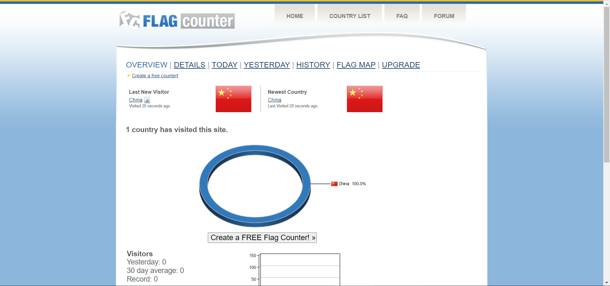
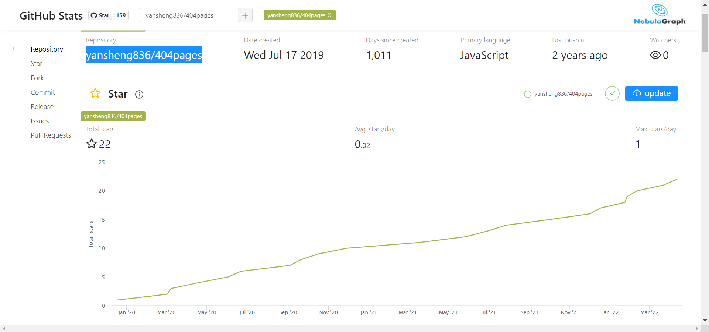

# 统计数据来源

github的一些统计视图的数据来源。

## github-readme-stats

[anuraghazra/github-readme-stats：为您的 github 自述文件动态生成的统计信息](https://github.com/anuraghazra/github-readme-stats)

### 示例

### 我的配置

## github-trends

[avgupta456/github 趋势：🚀使用可自定义的卡片（包括 LOC 统计信息）升级您的 GitHub 个人资料自述文件！](https://github.com/avgupta456/github-trends)

### 示例

### 我的配置

[GitHub Trends](https://www.githubtrends.io/wrapped/yansheng836)

## 访问者数量统计visitor count

有多种统一源，我用的是下面的这个，忘记是哪里找到的了。

可参考：[在您的 GitHub 个人资料中添加一行 Markdown - DEV 社区访客数量](https://dev.to/ryanlanciaux/visitor-count-on-your-github-profile-with-one-line-of-markdown-593g)

[快速 GitHub 配置文件访问计数器 - DEV 社区](https://dev.to/ryanlanciaux/quick-github-profile-visit-counter-14en)

我的配置：https://profile-counter.glitch.me/yansheng836/count.svg

---

### 其他方式

1.[Visitor Badge (visitor-badge.glitch.me)](https://visitor-badge.glitch.me/#docs)： 

https://visitor-badge.glitch.me/badge?page_id=yansheng836.visitor-badge&left_color=green&right_color=red

2.komarev.com

https://github.com/antonkomarev/github-profile-views-counter

https://komarev.com/ghpvc/?username=yansheng836&color=green

## 访问者数量统计flagcounter

[旗帜柜台 - 免费柜台 - 即时，简单和有趣！ (flagcounter.com)](https://www.flagcounter.com/index.html?)

可以统计每个国家的访问者数量。

### 我的配置

[URL=https://info.flagcounter.com/f03j][IMG]https://s05.flagcounter.com/count2/f03j/bg_FFFFFF/txt_000000/border_CCCCCC/columns_2/maxflags_10/viewers_0/labels_1/pageviews_1/flags_0/percent_0/[/IMG][/URL]

### 效果

https://s05.flagcounter.com/more/f03j/

## 各种徽章shields

[Shields.io: Quality metadata badges for open source projects](https://shields.io/)

## 星星历史

有多个工具

### star-history

https://star-history.com

测试：

#### 具体时间版本

[GitHub Star History (star-history.com)](https://star-history.com/#yansheng836/awesome-software&Date)

#### 大概时间线版本

https://star-history.com/#yansheng836/awesome-software&Timeline
https://api.star-history.com/svg?repos=yansheng836/awesome-software&type=Timeline

#### 多仓库混合

https://star-history.com/#yansheng836/404pages&Timeline

混合后：

https://star-history.com/#yansheng836/404pages&yansheng836/awesome-software&Timeline

### starchart.cc

> 现在，你只需要在仓库url中把 `github.com` 域名改为 `starchart.cc` 回车即可观看 Star 趋势了
>  而且，还支持把该趋势图插入到自己仓库的 Readme.md 文件中哦！
>  当然，由于是 Markdown 插图语法，也可以插入到自己的博客(简书不行，不支持外链图片且转站内还失败)。
>
> 作者：雨落随风
> 链接：https://www.jianshu.com/p/21e420386a7a
> 来源：简书
> 著作权归作者所有。商业转载请联系作者获得授权，非商业转载请注明出处。

参考：[怎么看一个github仓库的点赞趋势? - 简书 (jianshu.com)](https://www.jianshu.com/p/21e420386a7a)

[Star Charts](https://starchart.cc/yansheng836/404pages)

https://starchart.cc/yansheng836/404pages

##  GitHub 数据统计工具

[Github Statistics 一个基于 React 的 GitHub 数据统计工具 - NebulaGraph - 博客园 (cnblogs.com)](https://www.cnblogs.com/nebulagraph/p/12095338.html)

[Github Statistics (vesoft-inc.github.io)](https://vesoft-inc.github.io/github-statistics/)

yansheng836/404pages

